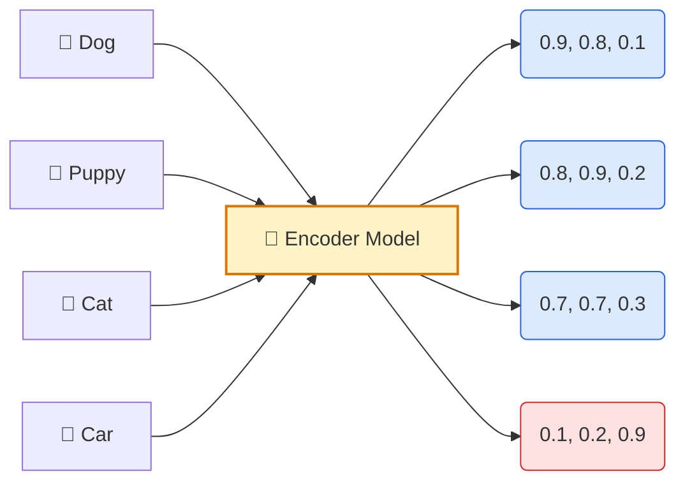
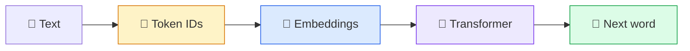
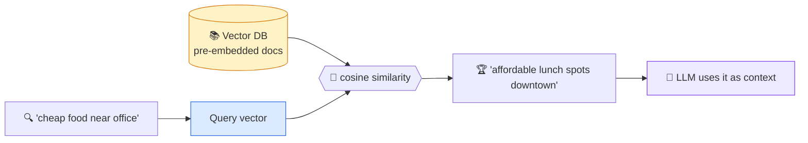

# Vector Embeddings

A **vector embedding** turns a piece of data (a word, sentence, or image) into a list of numbers — a point in high-dimensional space.

**Vector Embedding(another defn)** = turning each token ID into a high-dimensional vector of numbers where semantic similarity becomes geometric closeness (so "dog" and "puppy" end up near each other in meaning-space).

> **The magic rule:** similar meanings → close points. Different meanings → far points.

---

## The Core Idea

Notice: `Dog`, `Puppy`, `Cat` get **similar numbers**. `Car` is very different.

---

## Measuring Similarity

We compute **cosine similarity** between two vectors. Result = 0 to 1.

| Pair          | Bar                | Score   | Verdict      |
| ------------- | ------------------ | ------- | ------------ |
| Dog ↔ Puppy   | ████████████████░░ | **92%** | ✅ Similar   |
| Dog ↔ Cat     | ███████████░░░░░░░ | **78%** | ✅ Related   |
| Dog ↔ Car     | █░░░░░░░░░░░░░░░░░ | **08%** | ❌ Unrelated |

---

## Why We Use Embeddings

- **Search by meaning** — find docs even when keywords don't match.
- **Recommend** — suggest similar songs, products, movies.
- **Cluster / classify** — group related items automatically.

---

# Where Embeddings Fit in an LLM

Every LLM (ChatGPT, Claude, Gemini) runs your prompt through **3 stages**:

| # | Stage        | What it does            |
| - | ------------ | ----------------------- |
| 1 | Tokenization | Text → token IDs        |
| 2 | Embedding    | IDs → vectors           |
| 3 | Transformer  | Vectors → smart vectors |

---

## Stage 3 — What Does the Transformer Actually Do?

This is the part most explanations skip. Here's the simplest mental model:

> **Each word's vector "looks at" every other word's vector, then updates itself based on what's around it.**

That looking-around step is called **self-attention**.

### The "bank" example

Consider the word `bank` in two different sentences:

| After Stage 2 (Embedding) | After Stage 3 (Transformer)              |
| ------------------------- | ---------------------------------------- |
| `"bank"` → always the same vector `[B]` | vector changes based on neighbors |

Now apply it:

| Sentence         | "bank" looks at | Final vector means... |
| ---------------- | --------------- | --------------------- |
| `"river bank"`   | `river`         | **shoreline** 🏞️       |
| `"bank account"` | `account`       | **money** 💰           |

Same word, **different surrounding words**, **different final vector**.

## Real-World Use — Semantic Search (RAG)

You type *"cheap food near office"* and get back *"affordable lunch spots downtown"* — even though zero keywords match.

> [!TIP]
> This is how **Cursor**, **Notion AI**, and **GitHub Copilot Chat** answer questions about your files.

---

## Tools You'll Encounter

| Layer             | Tools                                                        |
| ----------------- | ------------------------------------------------------------ |
| Tokenization      | `tiktoken`, `SentencePiece`, HuggingFace `tokenizers`        |
| Embedding API     | OpenAI `text-embedding-3`, Cohere `embed`, Voyage `voyage-3` |
| Vector storage    | Pinecone, Qdrant, Weaviate, `pgvector`, Chroma               |
| Transformer (LLM) | GPT-4, Claude, Gemini, LLaMA 3, Mistral                      |

---

## One-Line Summary

> **Tokenize** text → **embed** tokens into vectors → **transform** so each vector understands its neighbors → predict the next token → repeat.

> [!TIP]
> Play with real embeddings in 3D at the [TensorFlow Embedding Projector](https://projector.tensorflow.org/).
