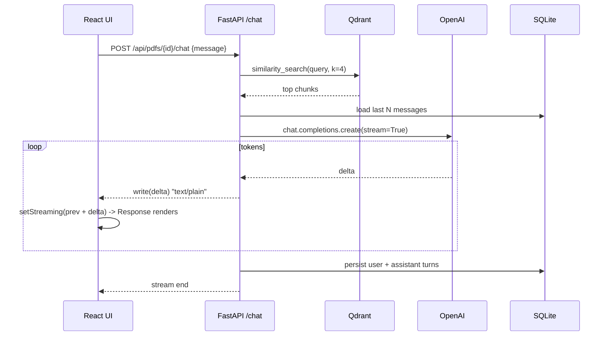

# Chat with PDF

Single-user RAG app: upload a PDF, ask questions about it, get answers cited by page.

## Stack

- **Frontend**: React + Vite + TypeScript + shadcn/ui + [Vercel AI Elements](https://ai-sdk.dev/elements/overview)
- **Backend**: FastAPI (Python 3.12) + LangChain + OpenAI
- **Vector DB**: Qdrant (one collection per PDF)
- **Metadata + chat history**: SQLite

## Architecture

```
React (5173) ──/api──▶ FastAPI (8000) ──▶ Qdrant (6333)
                          │
                          └─▶ SQLite + filesystem (Docker volume)
```

- Upload returns immediately; indexing runs in a FastAPI background task. UI polls status.
- Each PDF gets its own Qdrant collection (`pdf_<uuid>`), so deletes are clean.
- Identical PDFs are deduped by SHA-256.
- Chat replies stream token-by-token over a plain HTTP stream.

## Setup

1. Install Docker Desktop.
2. Copy the env file and add your OpenAI key:
   ```bash
   cp .env.example .env
   # edit .env, set OPENAI_API_KEY
   ```
3. Start everything:
   ```bash
   docker compose up --build
   ```
4. Open http://localhost:5173.

That's it. No `npm install`, no `uv sync` on the host — both run inside containers.

## Streaming

Chat replies are streamed token-by-token end-to-end. Sequence:



**Why plain text and not SSE / WebSockets:** the stream is one-way (server → client), so SSE event framing buys nothing, and `EventSource` can't POST anyway. WebSockets are bidirectional overkill. We just write tokens to the response body and the browser reads them with `fetch` + `ReadableStream.getReader()`.

**Persistence:** the user + assistant turns are saved to SQLite **only after** the stream completes. If the client disconnects (or the user closes the tab) mid-stream, neither turn is saved — partial replies never end up in history.

**Cancellation (future):** the `streamChat` helper accepts an `AbortSignal`. Wiring a "stop" button on the UI is a one-liner against `AbortController`.

## AI Elements

We use [Vercel AI Elements](https://ai-sdk.dev/elements/overview) — a shadcn-style registry of AI-native components (Conversation, Message, Response, PromptInput, Loader). The components are **vendored** under [`frontend/src/components/ai-elements/`](frontend/src/components/ai-elements/) (MIT-licensed) so the project builds reproducibly inside Docker without an extra setup step.

To add more components later (e.g. `code-block`, `reasoning`, `suggestion`):

```bash
docker compose exec frontend npx ai-elements@latest add <component>
```

Markdown rendering uses [`streamdown`](https://www.npmjs.com/package/streamdown), which is designed for partial / mid-stream content (won't break on a half-emitted code fence).

## Useful endpoints

- `GET /api/pdfs` — list PDFs
- `POST /api/pdfs` — upload (multipart `file`)
- `DELETE /api/pdfs/{id}` — remove PDF + collection + history
- `GET /api/pdfs/{id}/messages` — chat history
- `POST /api/pdfs/{id}/chat` — streamed reply (`{"message": "..."}`)
- Qdrant dashboard: http://localhost:6333/dashboard

## Cost notes

Each turn re-injects the retrieved chunks (top-k = 4 from Qdrant) **plus** the last `HISTORY_WINDOW` messages. So input tokens grow roughly linearly with `HISTORY_WINDOW`. Defaults aim for a sensible balance (6); set `HISTORY_WINDOW=0` in `.env` for single-shot Q&A, or raise it for stronger conversational continuity. With `gpt-5-nano` this is cheap either way.

## Resetting

```bash
docker compose down -v   # also drops Qdrant + SQLite volumes
```
